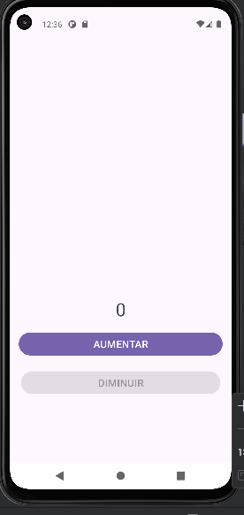

<h1 align="center">Contador_Kotlin</h1>

## Project
This is an Android application implemented for a counter with two functions: increasing and decreasing the value starting at 0. When it reaches 0, the decrease button is deactivated.

## Layout
<div align="center">
  
</div>

## Technologies Used
- *Programming Language:* Kotlin
- *Development Environment:* Android Studio

## Code Author
```kotlin
fun main() {
    println("Code by Marcela Geremias!")
}